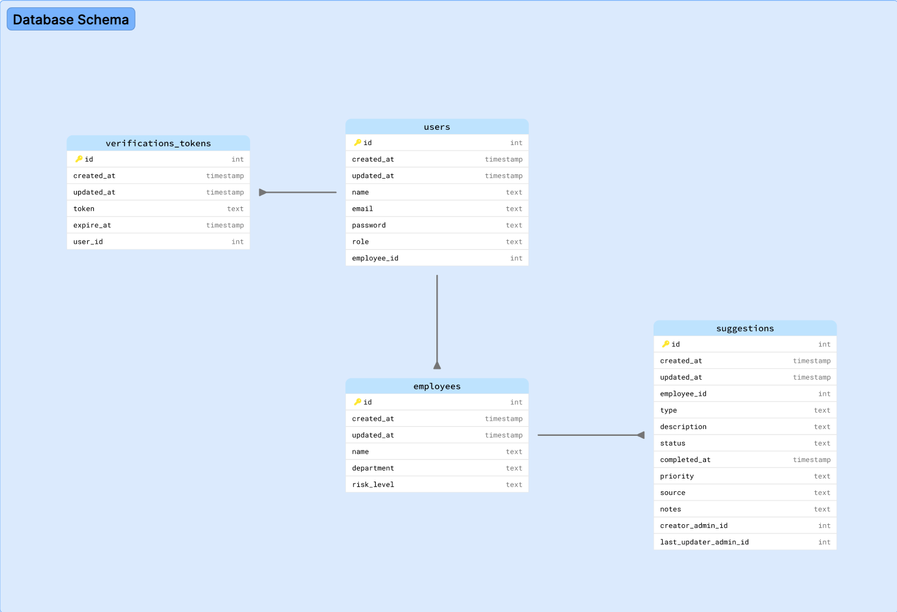

<a name="msk-management-board"></a>

# MSK Management Board

<a name="about"></a>

## About

**MSK Management Board** is a board that helps companies keep track of MSK suggestions, whether they have been added automatically by VIDA system or manually by admins of the board. This system allows admins, such as HR/H&S teams, to view suggestions, change their status, and add new suggestions. Moreover, the system includes a dashboard that analyzes the suggestions and presents these analyses in charts to give users an overall view of the suggestions.


## Table of contents

- [MSK Management Board](#msk-management-board)
  - [About](#about)
  - [Table of contents](#table-of-contents)
  - [Features](#features)
  - [Project Architecture](#project-architecture)
  - [Getting Started](#getting-started)
  - [Demo](#demo)
  - [Contributing](#contributing)
  - [License](#license)
  - [Show your support](#show-your-support)

<a name="features"></a>

## Features

- **Dashboard**
  Displays charts for quick insights, including a bar chart showing MSK types for all suggestions (percentage comparison), Kanban-style cards for statuses (Pending, In Progress, Completed, Overdue) with suggestion counts and sparklines over time, and a pie chart showing priorities.

- **Table View**
  A scalable table to view all suggestions with filters for type, priority, status, and source, plus a search box for employee name or ID. Ideal for managing large datasets without clutter. Users can also sort suggestions by created_at date or priority by clicking the respective table header cell, making it easy to organize data.

- **Suggestion Details**
  Click any row in the table to open a drawer showing full suggestion details.

- **Add Suggestion**
  Admins can add new suggestions via a drawer form accessed by the "New Suggestion" button.

- **Clean, Responsive UI**
  All features are delivered in a modern, clean design optimized for all screen sizes.

<a name="project-architecture"></a>

## Project Architecture

- **Technology Stack**

  - **Frontend & Backend: Next.js with React:**

    _Why Next.js was chosen over plain React for several reasons:_

    **Full-Stack Capabilities:** Next.js was chosen because it enables building the application as a full-stack solution, not just a frontend interface. Unlike plain React, which focuses solely on the client side, Next.js provides built-in support for backend functionality through API routes and server actions. This allows the application to manage its own database, handle data fetching, and perform server-side operations seamlessly — without relying on an external backend or losing state when the page is refreshed.

    **Future Complexity:** Next.js supports Server-Side Rendering (SSR) and Static Site Generation (SSG), allowing pages like the dashboard page to pre-rendered. This delivers faster perceived load times and better performance — essential for data-heavy dashboards, which is by time this board will be.

    **Database - SQLite3:** SQLite3 was chosen as a lightweight relational database that integrates seamlessly with Next.js and is ideal for prototyping. A relational database was preferred over a non-relational option like MongoDB because the data model includes clear relationships — for example, each employee can have multiple suggestions and can also act as an admin or regular user. Handling such structured relations is more intuitive and efficient in SQL than in document-based databases, where joining or aggregating related data can be less straightforward.

    **Styling & Design:** Chakra UI for a clean, accessible, and consistent UI.

- **Architecture & Project Structure**

  - **Feature-Based Structure:** The project is organized using the src/features pattern, keeping related files together for better scalability and maintainability.

  - **Client State Management: Zustand:** Zustand, a lightweight and hook-based state management library, was chosen to handle client-side state that lives entirely within the application. It manages both global state — such as the sidebar’s open/close status and the logged-in admin’s information — and feature-specific state within individual modules. Zustand provides excellent performance and scalability, minimizing unnecessary re-renders while keeping the codebase modular, predictable, and easy to maintain.

  - **Server State Management: React Query:** React Query was selected to manage server-side state, handling data that comes from the database. It efficiently manages fetching, caching, background refetching, and optimistic updates (such as when a suggestion’s status changes), freeing components from manually handling loading and error states. This results in smoother data synchronization and a more responsive user experience.

- **Database Schema**

  The SQLite database is structured to support core features such as managing suggestions, employees, and querying analytics data.

  

<a name="getting_started"></a>

## Getting Started

\_run it locally by following these steps:

Clone the project
Download the project files to your local machine:

```bash
git clone https://github.com/Maha-Magdy/msk-management-board.git
```

Install dependencies
Navigate into the project directory, and install the required packages:

```bash
cd msk-management-board
npm install
```

Initialize the Database
After installing dependencies, run the following commands to initialize and seed the database:

```bash
# Initialize the database
node initdb.js

# Seed the database with sample data
node seed.js
```

Run the development server
Start the local development server:

```bash
npm run dev
```

After running this command, you will see output similar to:

```arduino

  ▲ Next.js 15.5.4
   - Local:        http://localhost:3000
   - Network:      http://192.168.1.94:3000

```

This will open the application in your browser
Open your browser and visit the Local URL provided (e.g., http://localhost:3000).

<a name="demo"></a>

## Demo

Here are the links to the video demos of the MSK Management Board:

🎥 [Video Demo Link \_ Part 1](https://www.loom.com/share/75a64a5985524a97b071f20d0e8fbba9?sid=4ad3fb58-e915-44eb-877e-5ccb313a7d86)

🎥 [Video Demo Link \_ Part 2](https://www.loom.com/share/f4d0b6d1f131491abde4da86f4ab60b6?sid=a3bfc0e8-a5fa-4dca-bac8-699c85fe01e5)

<a name="contributing"></a>

## Contributing

Contributions, issues, and feature requests are welcome!

Feel free to check the [issues page](https://github.com/Maha-Magdy/msk-management-board/issues).

<a name="license"></a>

## License

This project is [MIT](./LICENSE) licensed.

## Show your support

Give a ⭐️ if you like this project!
