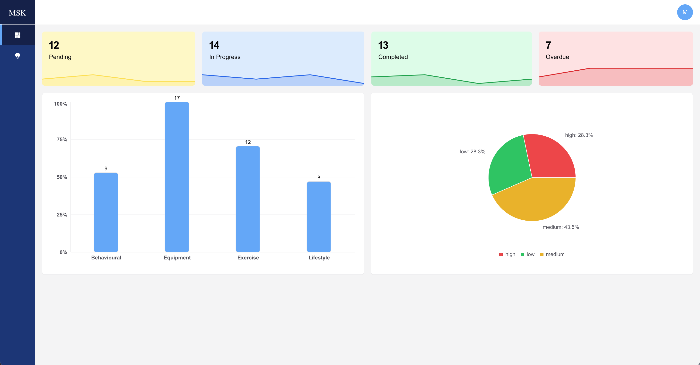
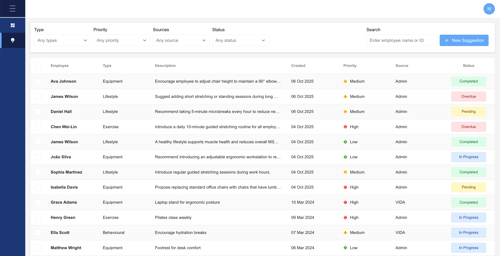

<a name="msk-management-board"></a>

# MSK Management Board

<a name="about"></a>

## About

**MSK Management Board** is a board that helps companies keep track of MSK suggestions, whether they have been added automatically by VIDA system or manually by admins of the board. This system allows admins, such as HR/H&S teams, to view suggestions, change their status, and add new suggestions. Moreover, the system includes a dashboard that analyzes the suggestions and presents these analyses in charts to give users an overall view of the suggestions.





## Table of contents

- [MSK Management Board](#msk-management-board)
  - [About](#about)
  - [Table of contents](#table-of-contents)
  - [Features](#features)
  - [Project Architecture](#project-architecture)
  - [Getting Started](#getting-started)
  - [Demo](#demo)
  - [Contributing](#contributing)
  - [License](#license)
  - [Show your support](#show-your-support)

<a name="features"></a>

## Features

- **Dashboard**
  Displays charts for quick insights, including a bar chart showing MSK types for all suggestions (percentage comparison), Kanban-style cards for statuses (Pending, In Progress, Completed, Overdue) with suggestion counts and sparklines over time, and a pie chart showing priorities.

- **Table View**
  A scalable table to view all suggestions with filters for type, priority, status, and source, plus a search box for employee name or ID. Ideal for managing large datasets without clutter. Users can also sort suggestions by created_at date or priority by clicking the respective table header cell, making it easy to organize data.

- **Suggestion Details**
  Click any row in the table to open a drawer showing full suggestion details.

- **Add Suggestion**
  Admins can add new suggestions via a drawer form accessed by the "New Suggestion" button.

- **Clean, Responsive UI**
  All features are delivered in a modern, clean design optimized for all screen sizes.

<a name="project-architecture"></a>

## Project Architecture

- **Technology Stack**

  - **Frontend & Backend: Next.js with React:**

      *Why Next.js was chosen over plain React for several reasons:*

      **Built-in API Routes:** Allows mocking the backend directly within the app, making development faster and easier. When a real backend is ready, API logic can be updated without affecting the frontend.

      **Future Complexity:** Next.js supports Server-Side Rendering (SSR) and Static Site Generation (SSG), allowing pages like the dashboard page to pre-rendered. This delivers faster perceived load times and better performance — essential for data-heavy dashboards, which is by time this board will be.

  - **Database: SQLite3:** a lightweight SQL database, simple to integrate with Next.js, and ideal for prototyping.

- **Architecture & Project Structure**

  - **Feature-Based Structure:** The project is organized using the src/features pattern, keeping related files together for better scalability and maintainability.

  - **Global State:** A lightweight hook-based state manager, which is Zustand is used for truly global state (e.g., sidebar (open/close) state currently, and in the future to store logged-in admin).

  - **State Management:** React Query is used for handling server state (fetching, caching, re-fetching, optimistic updates), freeing components from manual loading/error handling.

  - **Styling & Design:** Chakra UI for a clean, accessible, and consistent UI. 
  
- **Database Schema**

  The SQLite database is structured to support core features such as managing suggestions, employees, and querying analytics data.

  

<a name="getting_started"></a>

## Getting Started

_run it locally by following these steps:

Clone the project
Download the project files to your local machine:

```bash
git clone https://github.com/Maha-Magdy/msk-management-board.git
```

Install dependencies
Navigate into the project directory, and install the required packages:

```bash
cd msk-management-board
npm install
```

Initialize the Database
After installing dependencies, run the following commands to initialize and seed the database:

```bash
# Initialize the database
node initdb.js

# Seed the database with sample data
node seed.js
```

Run the development server
Start the local development server:

```bash
npm run dev
```

After running this command, you will see output similar to:

```arduino

  ▲ Next.js 15.5.4
   - Local:        http://localhost:3000
   - Network:      http://192.168.1.94:3000

```

This will open the application in your browser
Open your browser and visit the Local URL provided (e.g., http://localhost:3000).

<a name="demo"></a>
  
## Demo

Here are the links to the video demos of the MSK Management Board:

🎥 [Video Demo Link _ Part 1](https://www.loom.com/share/75a64a5985524a97b071f20d0e8fbba9?sid=4ad3fb58-e915-44eb-877e-5ccb313a7d86)

🎥 [Video Demo Link _ Part 2](https://www.loom.com/share/f4d0b6d1f131491abde4da86f4ab60b6?sid=a3bfc0e8-a5fa-4dca-bac8-699c85fe01e5)

<a name="contributing"></a>

## Contributing

Contributions, issues, and feature requests are welcome!

Feel free to check the [issues page](https://github.com/Maha-Magdy/msk-management-board/issues).

<a name="license"></a>

## License

This project is [MIT](./LICENSE) licensed.

## Show your support

Give a ⭐️ if you like this project!
